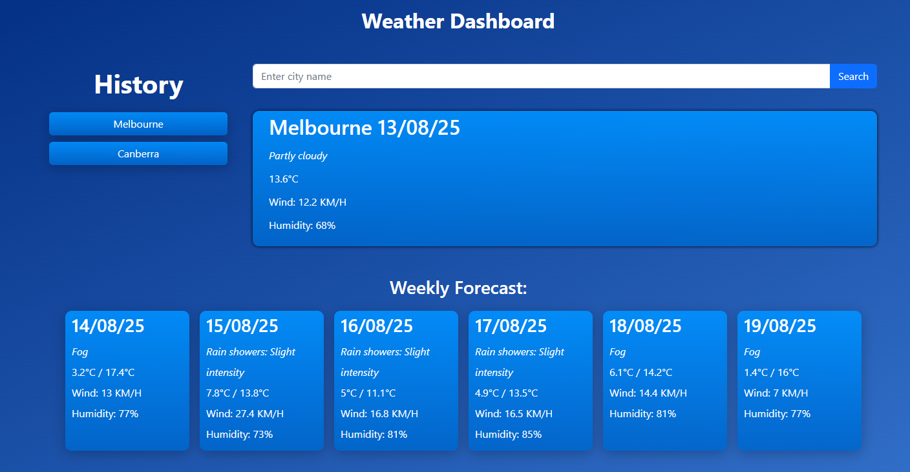

# Weather App

## Description
A weather app that uses the OpenWeather API to display the current and 5 day forecast weather data on a dashboard. You can search for cities with your search results saved on the left side. The results are also saved in localStorage for faster response times.

the app is deployed to https://seangenge.github.io/Weather/

## Tools/Languages
 - JQuery
 - Bootstrap
 - HTML
 - CSS
 - OpenWeather API

## Usage
To use the code, git clone to your pc

Example look at the app:
